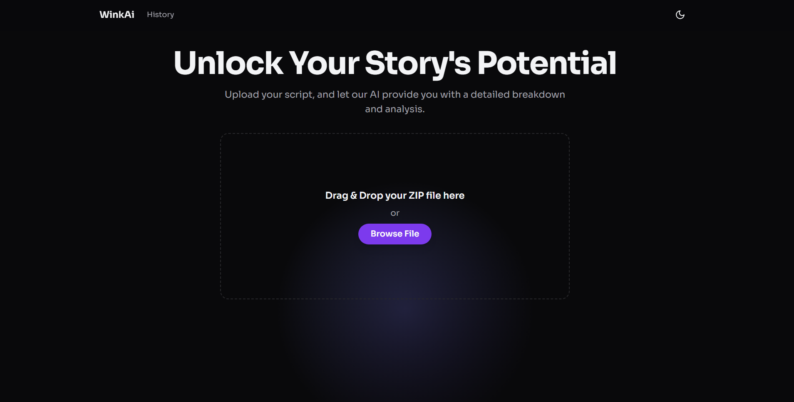
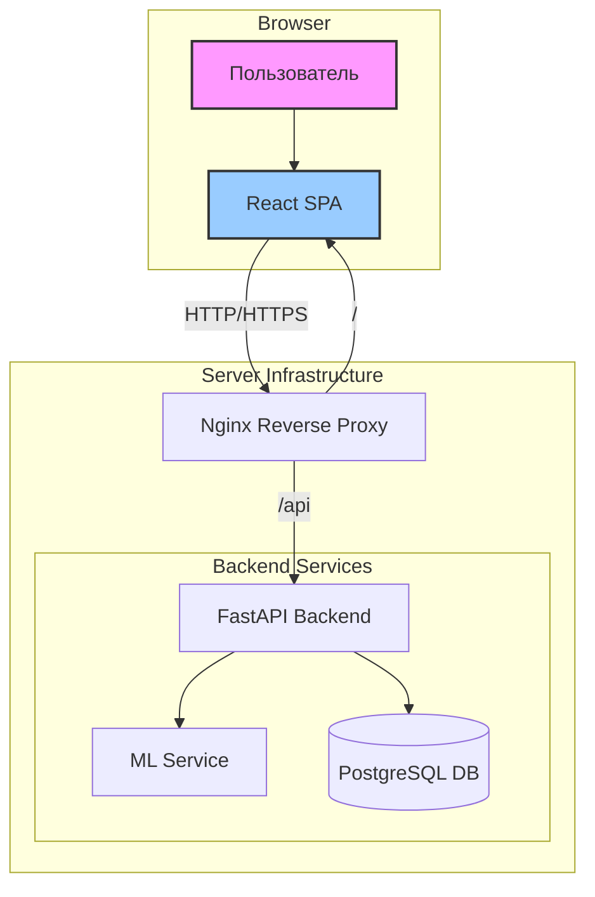

# WINK_AI - Preproduction Table Service

<p align="center">
  
  
  
  
  
  
  
  
  
  
</p>



## 📖 Обзор

**WINK_AI** — это интеллектуальная платформа, созданная для революционизации процесса подготовки к производству в кино- и видеоиндустрии. Она решает одну из самых трудоемких задач — разбор сценария и составление производственных таблиц. Вместо многочасовой ручной работы ассистенты и продюсеры могут просто загрузить сценарий и получить готовую, структурированную таблицу со всеми ключевыми элементами: персонажами, локациями, реквизитом, костюмами и многим другим.

Это приложение не просто экономит время, оно минимизирует человеческие ошибки и позволяет команде сосредоточиться на творческих, а не на рутинных аспектах производства.

<!--
**✨ [Демо-версия доступна здесь](https://your-demo-link.com)**
-->

## 🚀 Ключевые возможности

-   **Интеллектуальный парсинг сценариев**: Наш ML-модуль анализирует семантическую структуру сценария в формате `.docx` для точного извлечения производственных сущностей.
-   **Динамическая визуализация данных**: Полученные данные можно просматривать в двух удобных форматах:
    -   **Таблица**: Классическое представление, идеально подходящее для детального изучения и планирования.
    -   **Интерактивный холст**: Визуальная схема, которая помогает увидеть связи между элементами сценария.
-   **Экспорт в стандартные форматы**: Готовую таблицу можно легко скачать в формате `.xlsx`, что обеспечивает полную совместимость с Microsoft Excel, Google Sheets и другим ПО, используемым в индустрии.
-   **Архив проектов**: Все результаты анализа сохраняются в истории. Вы можете в любой момент вернуться к предыдущим версиям, сравнить их или скачать заново.

## ⚙️ Детальная архитектура

Проект построен на основе гибкой и масштабируемой микросервисной архитектуры. Все компоненты изолированы в Docker-контейнерах и управляются через `docker-compose`. Это обеспечивает надежность и простоту развертывания.



### Компоненты системы

1.  **Frontend (React + Vite)**
    -   **Роль**: Пользовательский интерфейс (UI).
    -   **Описание**: Это одностраничное приложение (SPA), созданное с помощью React и TypeScript. Оно отвечает за всё, что видит и с чем взаимодействует пользователь: форма загрузки, отображение таблиц и схем, навигация. Использование Vite обеспечивает сверхбыструю разработку и сборку. Framer Motion используется для создания плавной и приятной анимации, улучшая пользовательский опыт.
    -   **Взаимодействие**: Общается с Backend'ом через REST API (HTTP-запросы).

2.  **Backend (FastAPI)**
    -   **Роль**: Оркестратор и центральный узел логики.
    -   **Описание**: Высокопроизводительный API-сервер на Python. Он выполняет следующие задачи:
        -   Принимает HTTP-запросы от Frontend.
        -   Валидирует загруженные файлы (проверяет, что это `.zip` с `.docx` внутри).
        -   Вызывает ML-сервис для выполнения основной работы по анализу.
        -   Сохраняет результаты анализа в базу данных PostgreSQL.
        -   Предоставляет эндпоинты для получения истории и скачивания файлов.
    -   **Взаимодействие**: Получает запросы от Nginx, отправляет задачи на ML-сервис, читает/пишет в базу данных.

3.  **ML Service (Python)**
    -   **Роль**: "Мозг" для анализа текста.
    -   **Описание**: Специализированный сервис, который содержит модель машинного обучения (ML). Его единственная задача — принять на вход файл сценария и вернуть структурированный `JSON` с извлеченными данными. Такая изоляция позволяет независимо обновлять, масштабировать или заменять ML-модель без воздействия на остальные части системы.
    -   **Взаимодействие**: Принимает запросы от Backend.

4.  **Database (PostgreSQL)**
    -   **Роль**: Долговременная память системы.
    -   **Описание**: Надежная реляционная база данных, используемая для хранения метаданных о загрузках (имя файла, дата создания, уникальный ID) и самих результатов анализа в формате `JSON`.
    -   **Взаимодействие**: Принимает CRUD-запросы (Создание, Чтение, Обновление, Удаление) от Backend через SQLAlchemy ORM.

5.  **Reverse Proxy (Nginx)**
    -   **Роль**: "Привратник" и распределитель трафика.
    -   **Описание**: Nginx выступает в роли единой точки входа для всех внешних запросов. Он:
        -   Направляет запросы, начинающиеся с `/api/...`, на Backend-сервис (FastAPI).
        -   Все остальные запросы отдает в пользу Frontend (React), позволяя загружать само приложение.
        -   Способен обрабатывать SSL-сертификаты для обеспечения HTTPS-соединения.
    -   **Взаимодействие**: Принимает весь входящий трафик и распределяет его между Frontend и Backend.

### 🌊 Схема потока данных (Data Flow)

Вот как данные проходят через систему при загрузке нового сценария:

1.  `Пользователь` открывает сайт. `Nginx` отдает статические файлы `React`-приложения.
2.  `Пользователь` выбирает `.zip`-архив и нажимает "Загрузить".
3.  `React` отправляет файл на эндпоинт `/upload`. `Nginx` перенаправляет этот запрос на `FastAPI`.
4.  `FastAPI` валидирует файл, сохраняет его и вызывает `ML-сервис`, передавая ему путь к файлу.
5.  `ML-сервис` обрабатывает `.docx`-файл и возвращает `JSON` с результатами анализа обратно на `FastAPI`.
6.  `FastAPI` сохраняет этот `JSON` в `PostgreSQL` и генерирует `.xlsx`-файл.
7.  `FastAPI` возвращает `React`-приложению `JSON` с результатами для немедленного отображения.
8.  `Пользователь` видит результаты в таблице/схеме и получает возможность скачать `.xlsx`-файл.

## 🏁 Локальная разработка

### Предварительные требования

-   [Docker](https://www.docker.com/get-started)
-   [Docker Compose](https://docs.docker.com/compose/install/)

### Установка и запуск

1.  **Клонируйте репозиторий:**
    ```bash
    git clone https://your-repository-url/WINK_AI.git
    cd WINK_AI
    ```

2.  **Настройте переменные окружения:**
    Создайте файл `.env` в корне проекта. Вы можете скопировать `example.env` (если он есть) или создать файл с нуля. Он должен содержать переменные для подключения к БД и другие секреты.
    ```env
    # Backend
    DATABASE_URL=postgresql://postgres:postgres@db:5432/postgres
    
    # Frontend
    VITE_API_URL=http://localhost/api
    
    # Postgres
    POSTGRES_USER=postgres
    POSTGRES_PASSWORD=postgres
    POSTGRES_DB=postgres
    ```

3.  **Сборка и запуск контейнеров:**
    Эта команда соберет Docker-образы (если их еще нет) и запустит все сервисы в фоновом режиме.
    ```bash
    docker-compose up -d --build
    ```

4.  **Доступ к приложению:**
    Приложение будет доступно в вашем браузере по адресу: `http://localhost`.

### Полезные команды

-   **Остановить все сервисы:**
    ```bash
    docker-compose down
    ```
-   **Остановить и удалить все данные (включая данные в БД):**
    ```bash
    docker-compose down -v
    ```
-   **Просмотр логов (например, для бэкенда):**
    ```bash
    docker-compose logs -f backend
    ```
    
## 🌐 API Эндпоинты

Краткий список основных эндпоинтов, предоставляемых FastAPI-бэкендом:

-   `POST /upload`: Загрузка `.zip`-архива со сценарием.
-   `GET /history`: Получение списка всех предыдущих анализов.
-   `GET /result/{upload_id}`: Получение детальных результатов для конкретного анализа.
-   `GET /download/{upload_id}`: Скачивание `.xlsx`-файла с результатами.